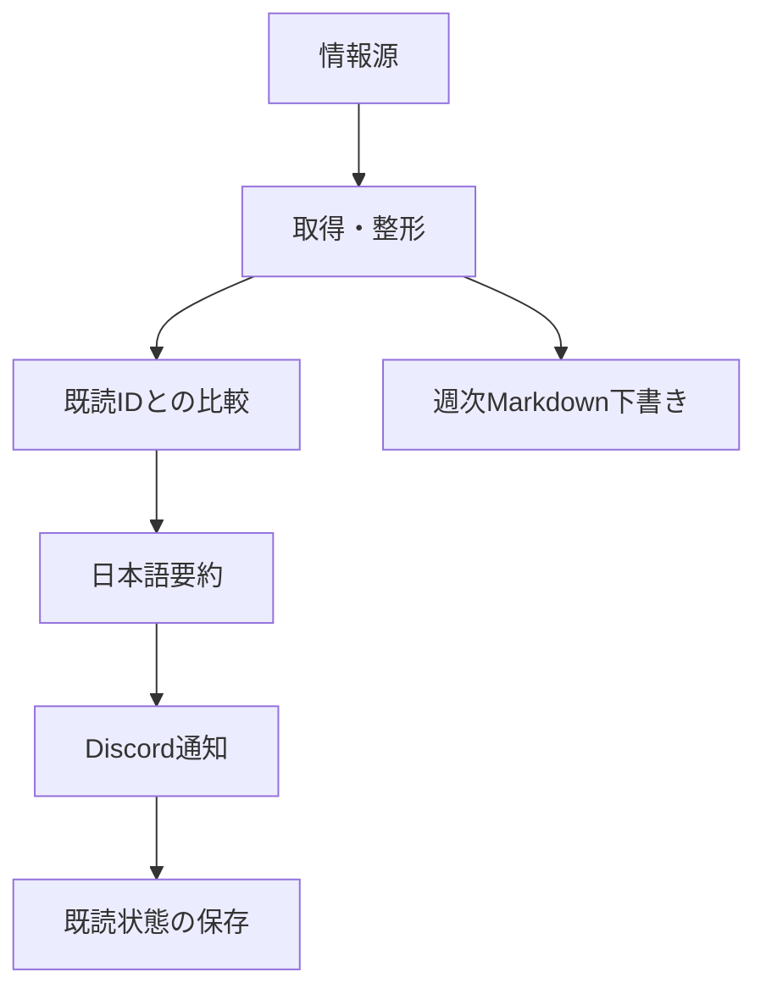

# tech-news-bot

AI・LLM関連の情報を収集し、新着を日本語で要約してDiscordへ通知するPython製Botです。個人利用していた仕組みをポートフォリオ用に整理しています。

収集先・通知先・要約を設定で分離し、既読IDを保存して重複通知を抑えます。週次のMarkdown下書き生成も含みます。

## 構成



| ファイル | 役割 |
|---|---|
| `main.py` | 収集・差分抽出・要約・通知・既読状態の保存 |
| `bot/delivery.py` | 重複排除、通知件数制限、日本語品質確認、送信後の状態確定 |
| `config.json` | 情報源・検索条件・要約設定 |
| `bot/github_trending.py` | GitHub Trendingの取得 |
| `bot/reddit.py` | RedditのRSS取得 |
| `bot/generate_note_draft.py` | 週次Markdown下書き生成 |
| `seen.json` | 通知済みID。実運用データは公開用コピーへ持ち込まない |
| `tests/` | 取得・整形・下書き生成の単体テスト |

## 現在の設定対象

| 情報源 | 設定 |
|---|---|
| arXiv | cs.AI / cs.CL、キーワードで絞り込み |
| Hacker News | スコア300以上 |
| TechCrunch・Product Hunt・Lobsters | RSS |
| Anthropic・OpenAI | config.jsonに指定したフィード。Anthropicは第三者提供の非公式フィード |
| GitHub Trending | 全言語とPython |
| Reddit | AI関連コミュニティと個人開発関連コミュニティ |

Indie Hackersの取得処理はコードに残っていますが、現在の `config.json` には設定がありません。稼働中の情報源として扱いません。外部フィードの到達性は変わるため、実行時の確認が必要です。

## セットアップ

Python 3.12、PowerShellの例です。

```powershell
python -m venv .venv
.\.venv\Scripts\python.exe -m pip install -r requirements.txt
```

| 環境変数 | 用途 |
|---|---|
| `GEMINI_API_KEY` | 日本語要約・翻訳 |
| `DISCORD_WEBHOOK_ARXIV` | arXivの通知 |
| `DISCORD_WEBHOOK_HN` | Hacker Newsの通知 |
| `DISCORD_WEBHOOK_TECH` | RSS系の通知 |
| `DISCORD_WEBHOOK_TRENDING` | Trendingの通知。未設定・空ならTECHへ送信 |
| `DISCORD_WEBHOOK_REDDIT` | Redditの通知。未設定・空ならTECHへ送信 |
| `DISCORD_WEBHOOK_SIDEHUSTLE` | 個人開発関連の通知。未設定なら送信しない |

秘密値はローカルの環境変数または実行先のSecretsに設定します。コード・README・スクリーンショットには含めません。

```powershell
# 実行すると外部通信が発生します。Webhook設定済みなら実際に通知します。
.\.venv\Scripts\python.exe main.py

# 取得結果を表示するだけ。要約API・Discord通知・状態ファイル更新は行いません。
.\.venv\Scripts\python.exe main.py --dry-run

# 外部通信なしの自作サンプル。実ニュースや実APIの結果は含みません。
.\.venv\Scripts\python.exe main.py --demo

# 週次下書き。output/にファイルを生成します。
.\.venv\Scripts\python.exe -m bot.generate_note_draft
```

## テスト

```powershell
.\.venv\Scripts\python.exe -m pip install pytest
.\.venv\Scripts\python.exe -m pytest tests/ -v
```

単体テストの対象は下書き生成・Trending・Redditの各モジュールです。全情報源の現行仕様やDiscordへの実配信を保証するものではありません。

通知は `config.json` の `notification.max_items`（全体上限）と
`notification.max_per_source`（情報源ごとの上限）で絞ります。同じ正規化URLは
情報源をまたいで一件にまとめ、要約のタイトル翻訳または本文要約が日本語にならない項目は
送信せず保留します。送信成功を確認した後にだけ `seen.json` と `delivery_state.json` を更新するため、
取得失敗・要約失敗・配信失敗の項目は次回に再試行できます。

## 公開版と個人運用

- 公開版の [収集workflow](.github/workflows/watch.yml) と [週次workflow](.github/workflows/weekly_note.yml) は手動実行のみです。コピーしただけでは定期実行されません。
- 手動実行も外部通信や通知を伴います。個人用の資格情報・配信先をそのまま複製しないでください。
- 元の個人運用では日次収集を毎朝08:00 JST、週次下書きを月曜09:00 JSTに実行する設定でした。この公開版の現在の稼働実績とは区別します。
- workflowの既読状態更新は `github-actions[bot]` 名義です。本人の開発コミットとは異なる自動運用の記録です。
- API・GitHub Actionsの利用料は契約と利用量に依存します。無条件に無料で動くサービスとはしていません。

## 工夫と制約

- ソース定義を `config.json` に集約し、情報源を切り替えやすくしています。
- APIやフィードの失敗を記録し、可能な範囲で他の情報源の処理を続けます。
- 既読管理にファイルを使い、別のデータベースを必要としない構成です。
- RSS・スクレイピング先は内容や仕様が変わり得ます。失敗時のログ確認が必要です。
- `bot/src/` はCloudflare Workers上の別コンポーネントです。上記Pythonパイプラインの起動には不要です。

## AIの活用

ニュースの日本語要約・翻訳にGemini APIを使用します。要約は誤り得るため、通知には一次情報へ戻れるリンクを残します。
